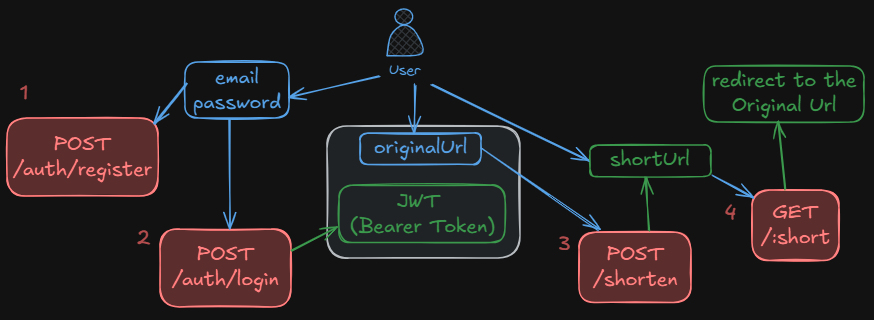

## Description
A url shortener made with NestJS.

## Deploy Link
https://url-shortener2-xzhs.onrender.com


## Diagram - main functionalities


## Project setup

### 1. Environment Variables
Copy the `.env.example` file to `.env`:
```bash
$ cp .env.example .env
```

Update the values in `.env`. 


### 2. Running the Project

#### Option 1: Using Docker (recommended)
1. Start database and app containers:
	```bash
	docker-compose up -d
	```
2. Run Prisma migrations and generate client inside the app container:
	```bash
	docker-compose exec app pnpm prisma migrate dev
	docker-compose exec app pnpm prisma generate
	```
3. Access the app at [http://localhost:3000](http://localhost:3000) and Swagger docs at `/api`.
4. (Optional) View logs after containers are running:
	 - App logs:
		 ```bash
		 docker-compose logs app --follow
		 ```
	 - DB logs:
		 ```bash
		 docker-compose logs db --follow
		 ```

#### Option 2: Without Docker
1. Make sure you have a local PostgreSQL (or compatible) database running and configured in `.env`.
2. Install dependencies:
	```bash
	pnpm install
	```
3. Run Prisma migrations and generate client:
	```bash
	pnpm prisma migrate dev
	pnpm prisma generate
	```
4. Start the app:
	```bash
	# development
	pnpm run start
	# watch mode
	pnpm run start:dev
	# production mode
	pnpm run start:prod
	```
5. Access the app at [http://localhost:3000](http://localhost:3000) and Swagger docs at `/api`.

## API Documentation (Swagger / OpenAPI)
This project uses Swagger (OpenAPI) for automatic API documentation.

### How to access
- Start the application (see above)
- Open your browser and go to: [http://localhost:3000/api](http://localhost:3000/api)

You will see an interactive UI to explore and test all API endpoints.

### How it works
- All controllers and routes are automatically documented.
- DTOs (request/response objects) are described if you use NestJS and Swagger decorators.
- The documentation updates automatically when you add new routes/controllers.

### Customizing documentation

#### Swagger Documentation

All API documentation is in the `swagger.json` file at the project root.
Update `swagger.json` whenever you add or change a route.

Official docs:
- https://docs.nestjs.com/openapi/introduction

## Run tests

```bash
# unit tests
$ pnpm run test

# e2e tests
$ pnpm run test:e2e

# test coverage
$ pnpm run test:cov
```


## Scalability

This application is designed to scale both horizontally and vertically:

### Horizontal Scaling
- **Stateless Design**: The application doesn't store session data in memory, making it safe to run multiple instances behind a load balancer.
- **Database Connection Pool**: Prisma manages database connections efficiently, allowing multiple app instances to share the same PostgreSQL database.
- **Docker Support**: Deploy multiple containers across different servers/regions for geographic distribution and high availability.

### Vertical Scaling
- **PostgreSQL Optimization**: Add indexes on frequently queried fields (slug, alias, ownerId) and enable query optimization.
- **Caching Layer**: Implement Redis for frequently accessed short URLs to reduce database load.
- **Database Read Replicas**: Use PostgreSQL read replicas for GET operations (redirects, listings) while writes go to the primary database.

### Performance Considerations
- **Base62 Slug Generation**: 6-character slugs provide 56+ billion unique combinations.
- **Soft Delete Pattern**: Deleted URLs remain in database for potential recovery, using `deletedAt` filter in queries.
- **Access Count**: Atomic increment operations prevent race conditions during concurrent redirects.

## Prettier & ESLint
Explanation of the scripts:

``format:check``: checks formatting without modifying files  
``lint:check``: checks lint without automatic fixes and fails if there are warnings  
``code:check``: runs both checks (useful for CI)  
``code:fix``: formats and automatically fixes issues  